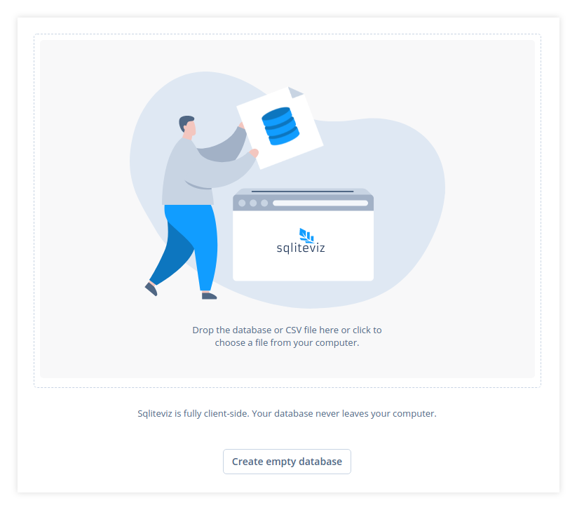
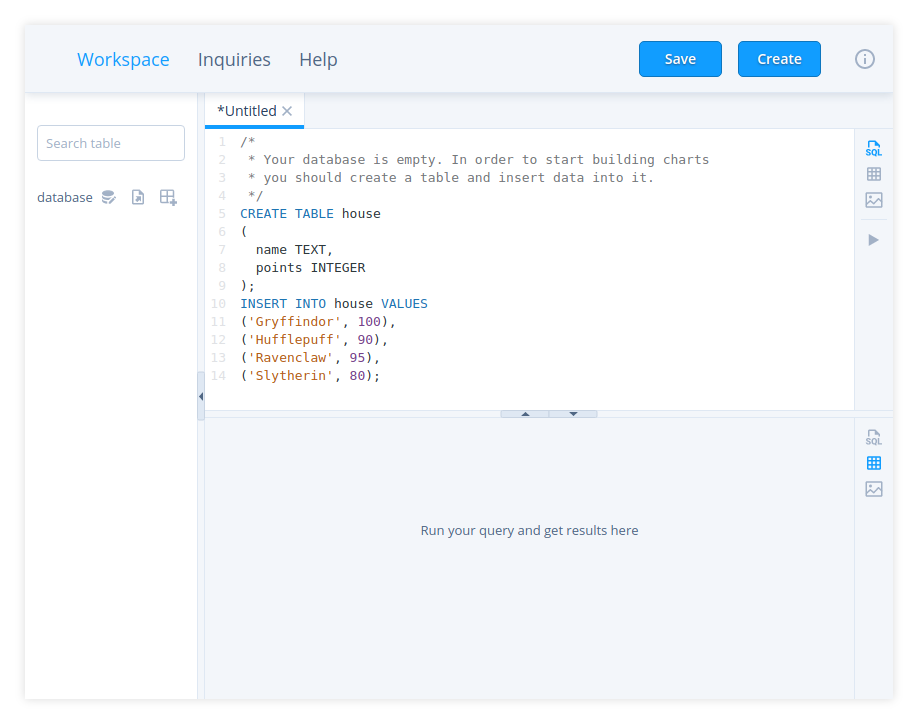
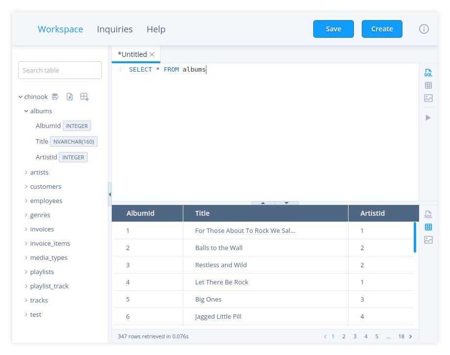

# Basic usage

## Choose SQLite database, CSV file, JSON or NDJSON file

You can choose a database, a CSV file, a JSON or NDJSON file right on the welcom page (fig. 1). The
supported file extentions: `.csv`, `.json`, `.ndjson`, `.db`,`.sqlite` and `.sqlite3`.

If you choose a CSV, JSON or NDJSON file it will be parsed. Then sqliteviz creates a new
database with data from the file. You can change table name
in the dialog which is shown automatically if you choose a CSV, JSON or NDJSON file. 
For CSV you can also change parsing settings (fig. 2).

If you don't have a database or CSV or JSON/NDJSON press `Create empty database` button and
then fill an empty database using DDL and DML statements. A tab with an example
of how to do it will be opened automatically (fig. 3).

Database tables, columns and their types are shown in the left panel of the
`Workspace` (fig. 4).

## Create inquiry

### Open new tab

Press `Create` button in the top toolbar or use `Ctrl+b` (`Cmd+b` for MacOS)
keyboard shortcut to open a new tab for an inquiry. An inquiry consists of three
parts: SQL query, result set (result of the query execution) and visualisation
of the result set. A tab consists of two panels. Each of them can show one of
the three parts of inquiry. By default the top panel shows SQL query editor and
the bottom panel shows the result set. You can switch any panel to any other
view with corresponding buttons in the right side toolbar.

*  – Switch the panel to an SQL query editor. In that
  editor you can specify and run not only a `SELECT` statement for getting data
  but also DDL/DML statements for modifying the database.
*  – Switch the panel to the result set. Here you
  can see the result of the query execution.
*  – Switch the panel to visualisation. This
  panel allows building a pivot table and charts from the result set.

> **Note:** The query editor can show you hints: SQL keywords, table and column
> names. In a common case column names are shown in the hint if you specify the
> table name, e.g. `SELECT table_name.`. But if there is only one table in your
> database column names will be always available in the hint. Press `Ctrl+Space`
> to show a hint explicitly.

### Run query

Press  button in the right side toolbar of an SQL
editor panel or use `Ctrl+r` or `Ctrl+Enter` (`Cmd+r` or `Cmd+Enter` for MacOS)
keyboard shortcut to execute a query in the current opened tab.

> **Note:**  Running is not available if a query for the current tab is not
> specified.

The query result will be displayed in the result panel (fig. 4).

### Create visualisation

After running a query switch any panel to the visualisation.  Switch to the
disired type of visualisation with buttons in the right side toolbar of the
visualisation panel.

*  – Switch to a chart type visualisation.
*  – Switch to a pivot type visualisation.

> **Note:**  All unsaved changes in the current visualisation will be lost when
> you switch to the other visualisation type.

A pivot table can be represented as a regular or multi-header table or
visualised with a chart.
Read more details of working with pivot in [Pivot tables][2].

All customised charts in sqliteviz are created with a `react-chart-editor`
component (fig. 5). The same component with some additional features is used in
Plotly Chart Studio. Explore its [documentation][1] to learn how to build charts
with `react-chart-editor`.

You can save any visualisation as an image by clicking .

## Save inquiry

Press `Save` button in the top toolbar or use `Ctrl+s` (`Cmd+s` for MacOS)
keyboard shortcut to save an inquiry in the current opened tab to local storage
of your browser.

After that, the inquiry will be in the list on `Inquiries` page.

> **Note:**  Only the text of the SQL query and the visualisation settings will
> be saved. The result of the query execution won't be saved.

[1]: https://plotly.com/chart-studio-help/tutorials/#basic
[2]: ../Pivot-table
