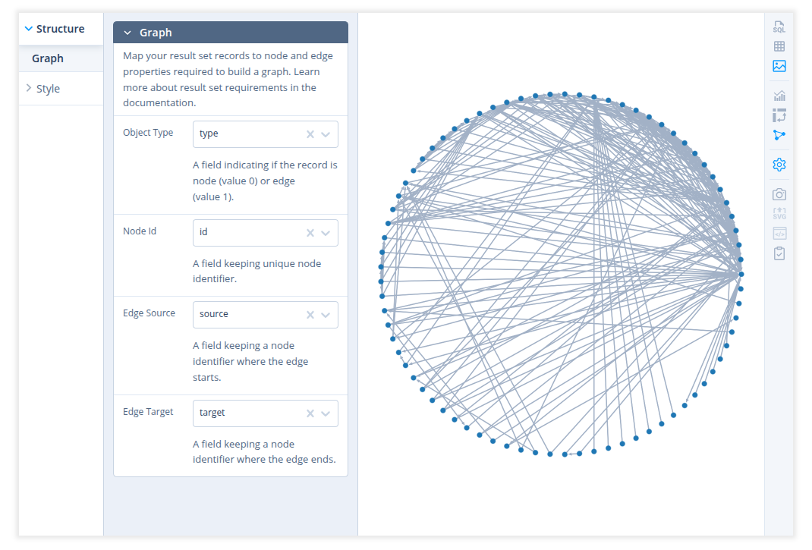
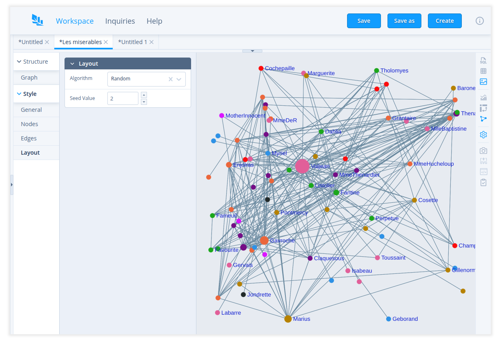
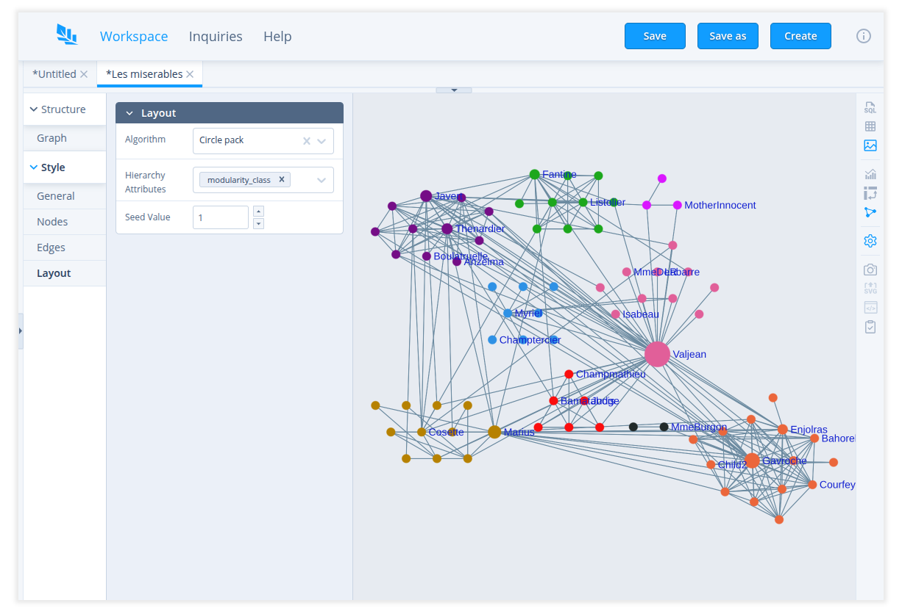
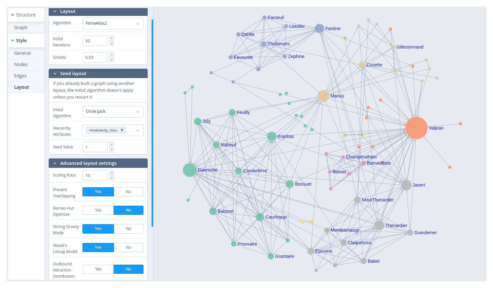

# Graph

Sqliteviz supports graph (network) visualisation. To build a graph, first run a query to get data.
Then open the visualisation panel by clicking 
in any of the two-side toolbars and choose the graph mode by clicking .

## Requirements for result set

To build a graph, a result set must follow the following requirements:

- the first column must contain JSON documents (subsequent columns in the result set are ignored)
- each JSON document has a key indicating whether the document represents a node/vertex (value `0`)
  or an edge (value `1`)
- each JSON document representing a node has a key with the node/vertex id
- each JSON document representing an edge has a key with the edge source node/vertex and a key with
  the edge target node/vertex

That is what is the minimum required for a graph, but the JSON documents can have more fields used
in graph styling (read [Graph styling](#graph-styling)).

See also an example in [How to get a result set suitable for graph visualisation][1].

## Graph structure

Start building a graph by setting a mapping from your documents to node and edge properties.
Go to `Structure` > `Graph` and set the following fields:

- Object type – a field containing `0` for node documents and `1` for edge documents.
- Node Id – a field containing the node identifier
- Edge source – a field keeping a node identifier where the edge begins.
- Edge target – a field keeping a node identifier where the edge ends.

This is already enough to build a graph with default styling and circular layout.



## Graph styling

### General

Set a background color of the graph in `Style` > `General` panel.

### Nodes

There are the following settings in `Style` > `Nodes` panel:

- Label - a field containing the node label. Note that if the graph has too many nodes or the node
  size is too small, some labels can be visible only at a certain zoom level.
- Label Color - a color of node labels
- Size - set a node size. There are 3 modes of node sizing: constant, variable and calculated.

  - `Constant` means that all nodes have the same given size.
  - `Variable` allows you to choose a field where the node size is taken from.
  - `Calculated` allows you to choose a method that is used to calculate the node size.

    Currently, 3 methods are available: total node degree, degree by in-edges and
    degree by out-edges.

  For variable and calculated sizing it's also possible to set the scale, the minimum
  size and the sizing mode - area or diameter. In the diameter mode the difference
  between node sizes is more noticeable.

- Color - set a node color. There are 3 modes of node color: constant, variable and calculated.

  - `Constant` means that all nodes have the same color.
  - `Variable` allows you to choose a field by which the color is determined.
    With this option you can also choose if the color value should be taken directly or mapped to a
    color palette.
  - `Direct` mode means that in the JSON document representing the node, the value in the selected
    field is used as a color. The color value in the JSON document can be set in different
    ways:

    1. As Hex, 8-digit (RGBA) Hex:

       ```
       #000
       000
       #369C
       369C
       #f0f0f6
       f0f0f6
       #f0f0f688
       f0f0f688
       ```

    2. RGB, RGBA:

       ```
       // As a string:
       rgb(255, 0, 0)
       rgb 255 0 0
       rgba(255, 0, 0, .5)

       // As a nested structure:
       { "r": 255, "g": 0, "b": 0 }
       ```

    3. HSL, HSLA:

       ```
       // As a string:
       hsl(0, 100%, 50%)
       hsla(0, 100%, 50%, .5)
       hsl(0, 100%, 50%)
       hsl 0 1.0 0.5

       // As a nested structure:
       { "h": 0, "s": 1, "l": .5 }
       ```

    4. HSV, HSVA:

       ```
       // As a string:
       hsv(0, 100%, 100%)
       hsva(0, 100%, 100%, .5)
       hsv(0 100% 100%)
       hsv 0 1 1

       // As a nested structure:
       { "h": 0, "s": 100, "v": 100 }
       ```

    5. Named colors:

       Case insensitive names are accepted, using the list of [colors in the CSS
       spec][2].

       ```
       RED
       blanchedalmond
       darkblue
       ```

  When `Map to` option is selected, the value by the selected field can be anything because it
  won't be used directly as a color. In this case each distinct value will be mapped to a certain
  color, so nodes with the same value will have the same color. Click on a color palette to open a
  palette selector.

  `Calculated` color mode allows to choose a method that will be used to determine a color.
  Currently, 3 methods are available: total node degree, degree by in-edges and degree by
  out-edges. You can also choose a color palette that will be used in a mapping of calculated
  values into an actual color.

- Color As - defines how color mapping should work - continuously or categorically.

  Continuous mode is more suitable when the mapped values have a meaningful order. It looks more
  informative with sequential palettes. In that case the lowest value corresponds to the first
  color in the palette and the highest value - to the last color. The color of each intermediate
  value reflects the position of that value in the range.

  Categorical mode just uses the next color in the palette for each new distinct value.

- Colorscale Direction - use the selected palette as is or reverse it.

### Edges

There are the following settings in `Style` > `Edges` panel:

- Direction - show an edges with or without arrows
- Label - a field containing an edge label. Note that if the graph has too many edges,
  some labels can be visible only at a certain zoom level.
- Label Color - a color of edge labels
- Size - set an edge thickness. There are 2 modes of edge sizing: constant and variable.

  - `Constant` means that all edges have the same thickness.
  - `Variable` allows you to choose a field where the edge size is taken from.

    For variable sizing it's also possible to set the scale and the minimum size.

- Color - set an edge color. There are 2 modes of edge color: constant and variable. They work
  similar to the node color modes.

- Color As - defines how color mapping should work - continuously or categorically, similar to the
  node color setting.

- Colorscale Direction - use the selected palette as is or reverse it.

### Layout

#### Circular

In this layout all nodes are just placed along a circle.

#### Random

This layout places nodes randomly for each seed value. The seed value allows you to restore the
random layout you liked when you open the inquiry and run the query next time.



#### Circle pack

Arranges nodes as a bubble chart according to specified attributes. You can choose multiple
hierarchy attributes to group nodes.



#### ForceAtlas2

A continuous graph layout algorithm. Read more details about the algorithm and its settings in the
[article][3]. The algorithm works iteratively. When you choose ForceAtlas2 layout or run the query,
it is automatically run 50 iterations of the algorithm. You can change the amount of steps run
automatically in `Initial Iterations`. You can also run and stop the algorithm manually by
clicking `Start`/`Stop` button.



[1]: ./How-to-get-result-set-suitable-for-graph-visualisation
[2]: https://www.w3.org/TR/css-color-4/#named-colors
[3]: https://journals.plos.org/plosone/article?id=10.1371/journal.pone.0098679
