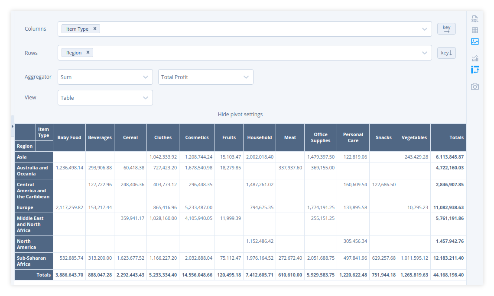
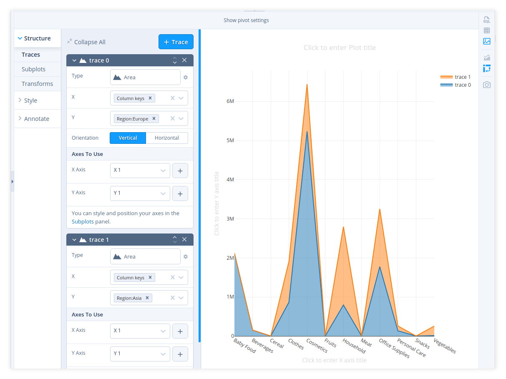

# Graph

Sqliteviz allows building a graph. To build a graph run a query to get data. 
Then open visualisation panel by clicking 
in any of the two side toolbars and choose a graph mode by clicking .

## Requirements for result set

To build a graph, a result set must follow the following requirements:

- the first column must contain JSONs (the rest columns in the result set will be ignored)
- each JSON has a common key indicating if the record represents a node (value 0) or an edge (value 1)
- each JSON representing a node has a common key with a node id
- each JSON representing an edge has a common key with the edge source and a common key with the edge target

Each JSON can have more fields used for graph styling (read more in [Graph styling](#graph-styling)).

## Graph settings

Start building a graph by setting a mapping from your records to nodes and edge properties.
Go to `Structure` -> 'Graph' and set the following fields:

- Object type – a field containing 0 for node records and 1 for edge records.
- Node Id – a field containing node identifier
- Edge source - a field keeping a node identifier where the edge starts.
- Edge target - a field keeping a node identifier where the edge ends.

There are several built-in chart views for a pivot. But you can build your own
with `Custom chart` view (fig. 4).

> **Note:**  You can switch to other pivot views and back to `Custom chart` –
> all your custom chart settings will be remembered. But if you switch the
> visualisation mode from pivot to any other mode, unsaved changes will be lost.

## Pivot table SQL

Pivot table (in the form of a result set) can be built on the SQL-level and,
technically speaking, can be visualised as any other result set. Practically
though there are a couple of challenges with that:

1. Visualising a dataset of long/tall shape is much more convenient in Plotly
   (chart editor) rather than one of wide/fat shape.
2. SQLite doesn't have a special constructs like `PIVOT` or `CROSSTAB` in
   its SQL dialect.

[How to build a pivot table in SQL(ite)][1] explores two options with static
(or beforehand-known) and dynamic columns.

[1]: ../How-to-build-a-pivot-table-in-SQ-Lite

