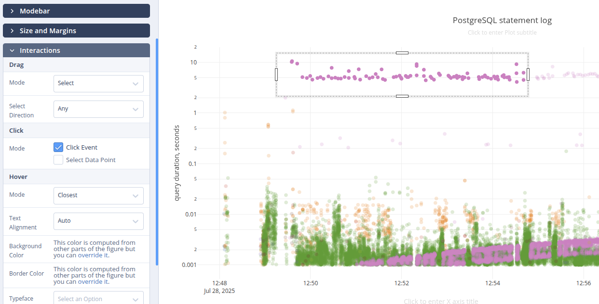

# How to work with Plotly interactive selection

Plotly supports interactive selection on some chart types, like scatterplot, 
where you can select a subset of the points. It may be helpful for live
presentation purposes, but there's no UI to interact with it if you want to
compute something from the selection, like the count of points.



This page proposes a workaround with browser console. Right click on the Plotly
chart and select *Inspect* in the context menu. In the opened browser DOM 
inspector scroll up and find the chart's container, matching 
`div.js-plotly-plot` CSS selector. Right click and select *Use in console* or
*Set as global variable* (depending on the browser). Then in *Console* tab paste
the following snippet (adjust to your needs):

```javascript
temp0.on('plotly_selected', function(eventData) {
  if (eventData) {
    const start = Date.parse(eventData.range.x[0])
    const finish = Date.parse(eventData.range.x[1])
    console.log('---------- Selected points ----------')
    console.log('Range, s:', (finish - start) / 1000)
    console.log('Count:', eventData.points.length)
  }
})
```

To update set listener, first unset the existing one with:

```javascript
temp0.removeAllListeners('plotly_selected')
```
