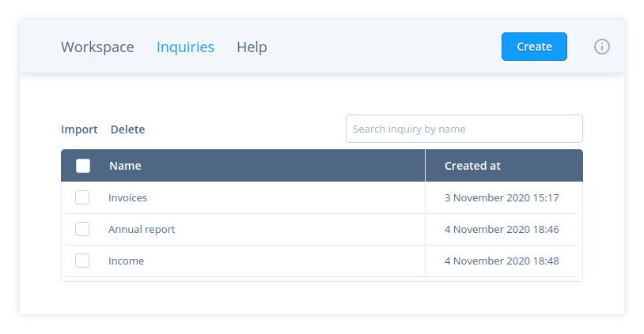
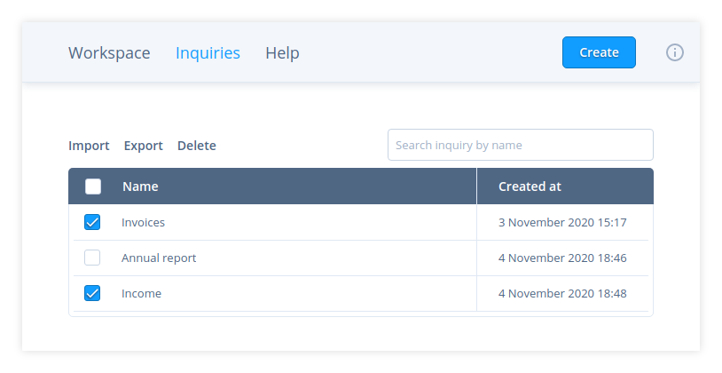

# Manage inquiries

## Organise

You can find all inquiries that you saved in `Inquiries` (fig. 1).

To manipulate one inquiry hover the cursor over the row with the inquiry and
choose the action:

*  – rename an inquiry
*  – duplicate an inquiry
*  – export an inquiry to JSON file
*  – delete an inquiry

To edit a query or visualisation settings of an inquiry click on the respective
row. You will be redirected to `Workspace` where the chosen inquiry will be
opened in a tab.

> **Note:** After opening an inquiry there will be no visualisation for it even
> if you specified it and saved. That is so because there is no data to build
> the visualisation. Run the query and all saved chart settings will be applied.

You can also delete or export a group of inquiries to a JSON file. Select
inquiries with checkboxes and press `Delete`/`Export` button above the grid
(fig. 2).

> **Note:** Some operations are not available for predefined inquiries. Read
> [Predefined inquiries][1] for details.

## Import

Click `Import` button on `Inquiries` page to import inquiries from a JSON file
generated by export.

[1]: ../Predefined-inquiries
