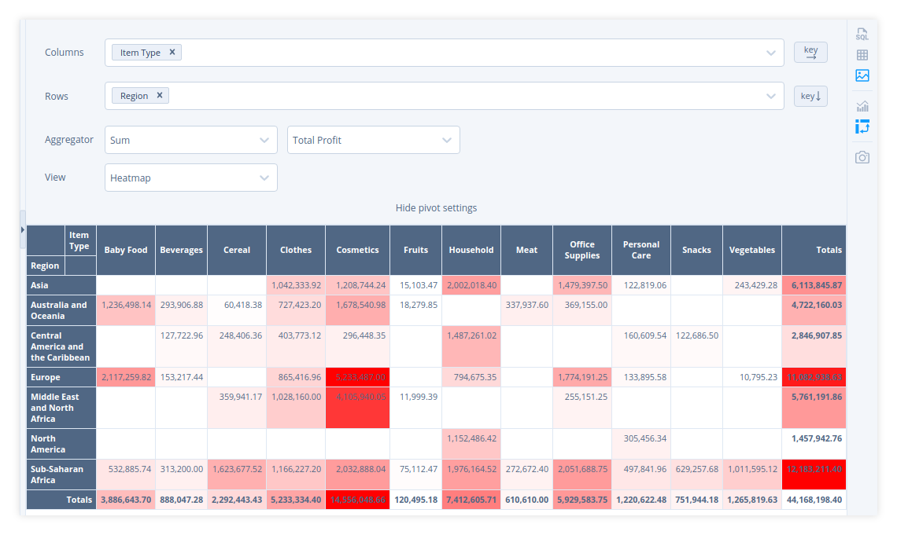
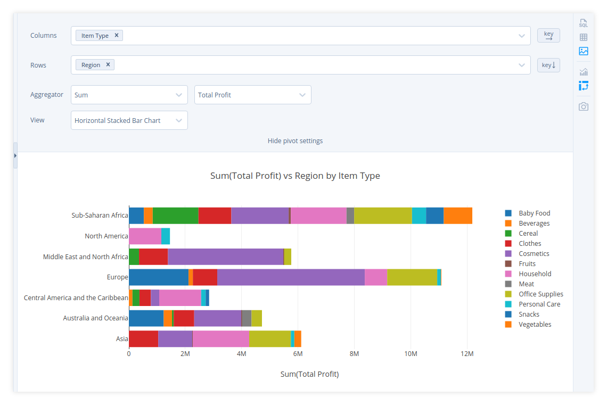

# Pivot table UI

Sqliteviz allows building pivot tables and visualizing them. To build a pivot
run a query to get data. Then open visualisation panel by clicking  in any of the two side toolbars and choose a
pivot mode by clicking .

A pivot visualisation has the following settings:

- Columns – choose one or more column names from the result set. The values in
  the chosen columns will be column names of the pivot table.
- Rows – choose one or more column names from the result set. The values in the
  chosen columns will be row names of the pivot table.
- Order of columns and rows.
- Aggregator and its arguments – a function which will be used for pivot cell
  calculation. An aggregator can have from zero to two arguments. An aggregator
  argument is one of the columns of the result set.
- View – pivot table visualisation. It can be a table, a heatmap, a chart,
  etc. See some examples of different views of the same pivot table below.

   

  
    Fig. 1: Table
  

   

  
    Fig. 2: Heatmap
  

   

  
    Fig. 3: Horizontal Stacked Bar Chart
  

There are several built-in chart views for a pivot. But you can build your own
with `Custom chart` view (fig. 4).

   

  
    Fig. 4: Custom Chart
  

> **Note:**  You can switch to other pivot views and back to `Custom chart` –
> all your custom chart settings will be remembered. But if you switch the
> visualisation mode from pivot to any other mode, unsaved changes will be lost.

You can save any visualisation as an image by clicking .

# Pivot table SQL

Pivot table (in the form of a result set) can be built on the SQL-level and,
technically speaking, can be visualised as any other result set. Practically
though there are a couple of challenges with that:

1. Visualising a dataset of long/tall shape is much more convenient in Plotly
   (chart editor) rather than one of wide/fat shape.
2. SQLite doesn't have a special constructs like `PIVOT` or `CROSSTAB` in
   its SQL dialect.

[How to build a pivot table in SQL(ite)][1] explores two options with static
(or beforehand-known) and dynamic columns.

[1]: How-to-build-a-pivot-table-in-SQLite
