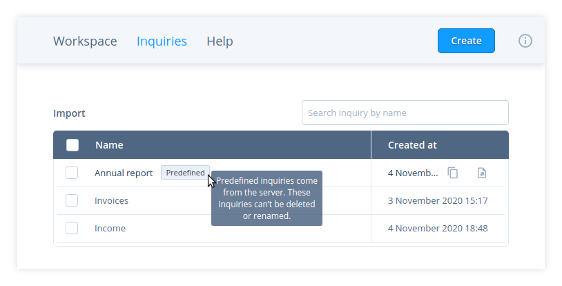

# Predefined inquiries

Predefined inquiries come out of the box on the sqliteviz instance. In sqliteviz
deployed on [Github Pages][1] there are no predefined inquiries, but you may
see them if you use sqliteviz integrated into another app.

These inquiries are shown in `Inqueries` list with a special label on the mouse
over (fig. 1).

As a user, you can't rename or delete a predefined inquiry. You can't save
changes in a predefined inquiry, but you can save them as a new inquiry. The
rest operations, copy and export, are available.

[1]: https://lana-k.github.io/sqliteviz
