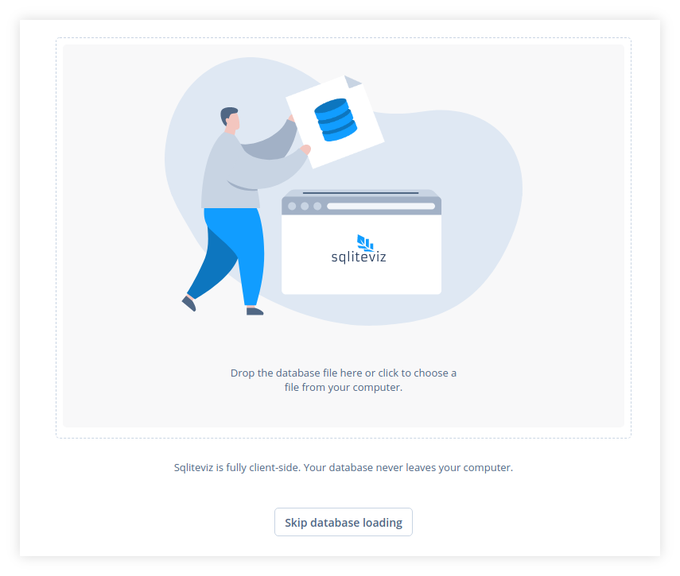
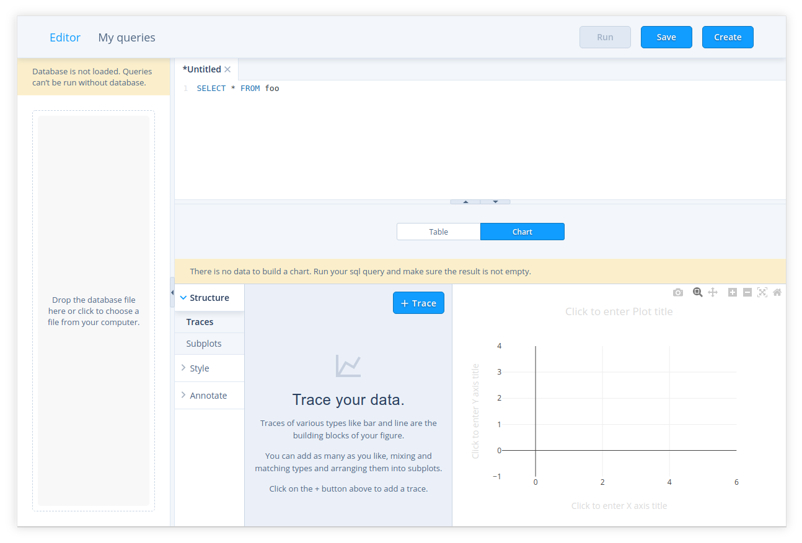
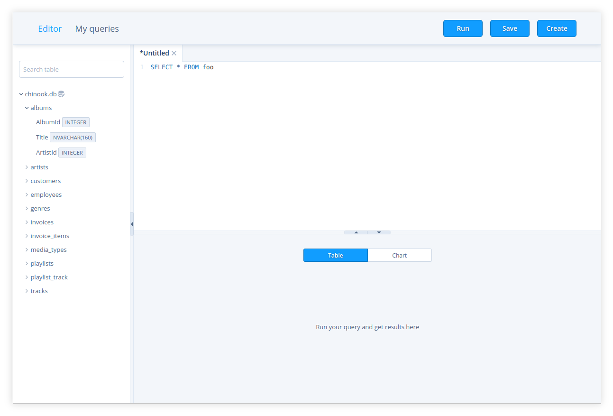
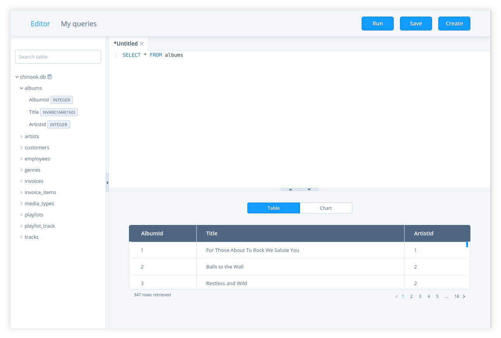
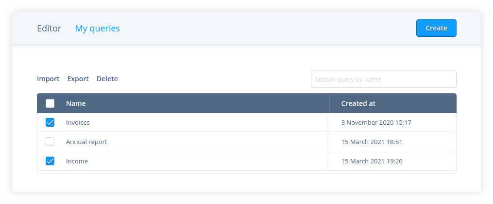

   

# sqliteviz

Sqliteviz is a single-page application for fully client-side visualisation of SQLite databases.

## Get started

The latest release of sqliteviz is running on [Github pages][6]. The simplest way to start is to use sqliteviz there.

### Choose a databese file

You can choose a database file right on the welcom page (fig. 1). The supported file extentions: `.db`,`.sqlite` and `.sqlite3`.

   

  
    Fig. 1: Welcome page
  

This is not a mandatory step. You can skip it and manipulate queries in sqliteviz without a database. Choose a database later in the left panel of the Editor when it's time to run a query (fig. 2).

   

  
    Fig. 2: Editor (database is not chosen) 
  

After chosing a database you can browse tables, columns and their types in the left panel of the Editor (fig. 3).

   

  
    Fig. 3: Editor (database is chosen)
  

### Create a query

#### Open a new tab

Press `Create` button in the top toolbar or use `Ctrl+b`(`Cmd+b` for MacOS) keyboard shortcut to open a new tab for a query. The tab consists of two parts: a query text editor on the top and a result panel on the bottom.

In the query text editor part you can specify a `SELECT` statement for getting data.

Result panel has two modes: table view (fig. 3, fig. 4) and chart view (fig. 2). In the table view you can see the result of query running (fig. 4). In the chart view there is a chart editor component which allows to build a visialization from the result set.

#### Run a query

Press `Run` button in the top toolbar or use `Ctrl+r`(`Cmd+r` for MacOS) keyboard shortcut to execute a query in the current opened tab.

> **Note:**  Running is not available if a database was not chosen or a query for the current tab is not specified.

The query result will be displayed in the result panel in table mode (fig. 4).

   

  
    Fig. 4: Query results
  

#### Create a chart

After running a query you can switch result panel to the chart mode and create a chart with a `react-chart-editor` component. The same component with some additional features is used in Plotly Chart Studio. Explore its [documentation][7] to learn how to build charts with `react-chart-editor`.

### Save a query

Press `Save` button in the top toolbar or use `Ctrl+s`(`Cmd+s` for MacOS) keyboard shortcut to save a query in the current opened tab to local storage of your browser.

After that the query will be in the list on "My queries" page.

> **Note:**  Only the text of the query and chart settings will be saved. The result of the query execution won't be saved.

## Working with saved queries

You can find all queries that you saved in local storage of your browser in "My queries" (fig. 5).

   

  
    Fig. 5: My queries
  

To manipulate one query hover the cursor over the row with the query and choose the action:

*  - rename a query
*  - duplicate a query
*  - export a query to json file
*  - delete a query

To edit the text of a query or its chart settings click on the respective row. You will be redirected to `Editor` where the chosen query will be opened in a tab.

> **Note:** After opening a query there will be no chart for it even if you specified it and saved. That is so because there is no data to build the chart. Run the query and all saved chart settings will be applied.

You can also delete or export to file a group of queries. Select queries with checkboxes and press `Delete`/`Export` button above the grid (fig. 6).

    

  
    Fig. 6: My queries: a group of queries is selected
   

> **Note:** Some operations are not available for predefined queries (see below).

## Import queries

Click `Import` button on "My queries" page to import queries from json file generated by export.

## Predefined queries

If you run sqliteviz on your own server you can specify predefined queries. These queries will be in "My queries" list for all users working with sqliteviz on your server.

To create a list of predefined queries choose queries in "My queries" list and export them to `queries.json`. Then place this file on the server in the same directory as `index.html`.

A user can't edit, rename or delete a predefined query. The rest operations are available.

## Motivation
It's a kind of middleground between [Plotly Falcon][1] and [Redash][2].

## Components
It is built on top of [react-chart-editor][3], [sql.js][4] and [Vue-Codemirror][8] in [Vue.js][5]. 

[1]: https://github.com/plotly/falcon
[2]: https://github.com/getredash/redash
[3]: https://github.com/plotly/react-chart-editor
[4]: https://github.com/sql-js/sql.js
[5]: https://github.com/vuejs/vue
[6]: https://lana-k.github.io/sqliteviz
[7]: https://plotly.com/chart-studio-help/tutorials/#basic
[8]: https://github.com/surmon-china/vue-codemirror#readme

