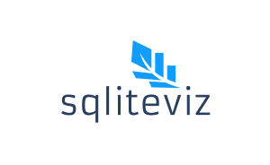

   

# sqliteviz

Sqliteviz is a single-page offline-first PWA for fully client-side visualisation of SQLite databases or CSV files.

With sqliteviz you can:
- run SQL queries against a SQLite database and create [Plotly][11] charts and pivot tables based on the result sets
- import a CSV file into a SQLite database and visualize imported data
- export result set to CSV file
- manage inquiries and run them against different databases
- import/export inquiries from/to a JSON file
- export a modified SQLite database
- use it offline from your OS application menu like any other desktop app

https://user-images.githubusercontent.com/24638357/128249848-f8fab0f5-9add-46e0-a9c1-dd5085a8623e.mp4

## Quickstart
The latest release of sqliteviz is deployed on [sqliteviz.com/app][6].

## Wiki
For user documentation, check out sqliteviz [documentation][7].

## Motivation
It's a kind of middleground between [Plotly Falcon][1] and [Redash][2].

## Components
It is built on top of [react-chart-editor][3], [PivotTable.js][12], [sql.js][4] and [Vue-Codemirror][8] in [Vue.js][5]. CSV parsing is performed with [Papa Parse][9].

[1]: https://github.com/plotly/falcon
[2]: https://github.com/getredash/redash
[3]: https://github.com/plotly/react-chart-editor
[4]: https://github.com/sql-js/sql.js
[5]: https://github.com/vuejs/vue
[6]: https://sqliteviz.com/app/
[7]: https://sqliteviz.com/docs
[8]: https://github.com/surmon-china/vue-codemirror#readme
[9]: https://www.papaparse.com/
[10]: https://github.com/lana-k/sqliteviz/wiki/Predefined-queries
[11]: https://github.com/plotly/plotly.js
[12]: https://github.com/nicolaskruchten/pivottable
